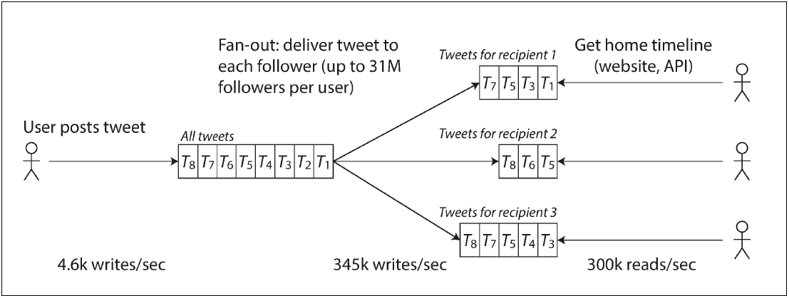

# Summary
## Data Intensive Application is typically:
- Store data to retreive it later (Database)
- Remember result of expensive operation to speed up reads (Cache)
- Allow user to search data by keyword or filter it in various ways (Search indexes)
- Preiodically crunch a large amount of accumlated data (batch processing)
## Data Systems Example

    

## Some questions to ask when designing a data system:
- How do you ensure that the data will remains correct and complete, even when things go wrong internally?
- How do you provide consistently good performance to clients, even when parts of your system are degraded?
- How do you scale your system to handle an increase in load?
- What does the good API for the system look like?
## Things that influence the design of a data system:
- The skills and experience of the people involved
- The time constraints
- Legacy systems dependencies
- The organization's tolerance for risk
## The most points that the book will cover:
- Reliability
  - The system should continue to work correctly (performing the correct function at the desired level of performance) even in the face of adversity (hardware or software faults, and human error).
- Scalability
    - As the system grows (in data volume, traffic volume, or complexity), there should be reasonable ways of dealing with that growth.
- Maintainability
    - Over time, many different people will work on the system, and they should all be able to work on it productively.
## Reliability
### Reliable system expectations:
- The application performs the function that the user expected.
- It can tolerate the user making mistakes or using the software in unexpected ways.
- Its performance is good enough for the required use case, under the expected load and data volume.
- The system prevents any unauthorized access and abuse.
### Then Reliability is about making systems work correctly, even when faults occur.
- The system that anticipates faults and can cope with them called "fault-tolerant" or "resilient".
- It's impossible to prevent all faults.
#### Fault: A fault is usually defined as one component of the system deviating from its spec.
#### Failure: The system as a whole stops providing the required service to the user.
- Faults can lead to failures, but not all faults lead to failures.
- It is usually best to design fault tolerance mechanisms that prevent faults from causing failures.
- Chaos monkey is a tool that randomly terminates servers in your production system to test if the system can tolerate it.
### When to prevent faults?
- This is the case of security matters
- If an attacker has compromised a system and gained access to a sensitive data.
### Faults types:
- Hardware faults
  - Hard drives crash, RAM becomes faulty, the power supply unit fails, the motherboard burns out, and so on.
  - Hardware faults are usually handled by replacing the hardware component (Redundancy).
- Software errors
  - Bugs in the code (e.g., unhandled exceptional conditions such as division by zero, null pointer dereference, or invalid format string).
  - Software errors can be handled by testing the software thoroughly, including writing automated tests that simulate various kinds of faults.
  - Examples: 
    - Using a language that checks for null pointer dereference at compile time.
    - Using a type system that ensures that a variable is always initialized before it is used.
    - Using a linter that statically analyzes the code to find suspicious patterns.
- Human errors:
  - Humans are known to be unreliable, 10-25% of incidents are caused by human error.
  - Solutions:
    - Design systems in a way that minimizes opportunities for error.
    - Decouple the places where people make the most mistakes from the places where they can cause failures (production and sandbox).
    - Test thoroughly at all levels, from unit tests to whole-system integration tests and manual tests.
    - Easy rollbacks.
    - Set up detailed and clear monitoring.
    - Implement good management practices and training.
### How important is reliability?
- It's not just for nuclear power stations and air traffic control systems.
- It's important for any system that stores or manipulates our data.
- Even if the system is not life-critical, reliability is still important, for example, if the system is difficult to repair or has a high cost of failure.
- There are situations in which we may choose to sacrifice reliability for other things, such as development speed or new features.
## Scalability
### Scalability definition:
`the term scalability refers to a system’s ability to cope with increased load.`
### Describing Load:
- Load can be described with a few numbers we call load parameters it may be:
  - Requests per second to a web server.
  - Ratio of reads to writes in a database.
  - Number of simultaneously active users.
  - Hit rate on a cache.
  - Proportion of a dataset that fits in memory.
### Example of Scalability:
- Twitter two main scalability challenges:
  - The number of tweets per second.
  - The number of followers per user.
  - The issue is:
    - fan-out on write: when a user posts a tweet, the tweet needs to be delivered to all of the user’s followers.
    - posting the tweet simply inserts it into a global collection of tweets
    - and reading a user’s timeline involves fetching the tweets from the global collection.
    - the query:
      - `SELECT tweets.*, users.* FROM tweets
         JOIN users ON tweets.sender_id = users.id
         JOIN follows ON follows.followee_id = tweets.sender_id
         WHERE follows.follower_id = current_user`
  - Solution:
    - Caching: the application caches the user’s home timeline every time they tweet it looks up the followers and inserts the tweet into their home timeline cache.
    - As the number of followers grows, the cache becomes larger and the cache update takes longer.
    - Diagram:
        

            
        

    - Hybrid solution:
      - The application uses a combination of the two approaches.
      - It uses a cache to store the home timeline of users with a moderate number of followers.
      - For users with a very large number of followers, it uses a database query to fetch the home timeline.
### Describing Performance:
- Once you have described the load on your system, you can think about how the system should behave as the load increases.
- You can look at it in two ways:
  - When increasing a load and keeping the system resources fixed, how is the performance affected?
  - When increasing the load, how much do you need to increase the resources to achieve that performance?
### Latency vs response time:
- Latency is the duration that a request is waiting to be handled.
- Response time is the time between a client sending a request and receiving a response.
### Percentiles:
- The median is the 50th percentile, the 95th percentile is the value below which 95% of the data falls.
- Percentiles are used to measure the tail latencies.
- The 99th percentile is a common choice for reporting performance numbers.
- The method to calculate any percentile:
  - Sort the response times and take the target (Usually its 95th percentile) percentile.
  - Example:
    - 95th percentile of [2, 3, 3, 4, 4, 4, 4, 5, 5, 6] using the interpolation so the result is 5.5 .
    - here is the calculation:
      - 95th percentile location: P x N = 0.95 x 10 = 9.5
      - The 95th percentile is between the 9th and 10th elements.
      - The 95th percentile is: V(before) + (V(after) - V(before)) x F = 5 + (6 - 5) x 0.5 = 5.5
      - V(before) = 5, V(after) = 6, F is the fraction of the location of the percentile = 0.5
### Approaches to coping with load:
- Scaling up (Vertical scaling):
  - Moving to a more powerful machine.
  - The main limitation is the cost of a single machine.
  - The main advantage is that it is usually easier to scale up.
- Scaling out (Horizontal scaling):
    - Distributing the load across multiple smaller machines.
    - The main advantage is that it is usually cheaper to scale out.
    - The main limitation is that it is usually harder to implement.
## Maintainability
### Maintainability definition:
`The ease with which a system can be maintained and modified in the future.`
### Maintainability is important because:
- The only constant in software is change.
- The software is not just written once and then left unchanged.
- The requirements change, bugs need to be fixed, and new features need to be added.
- The cost of maintaining a software system over its lifetime will be at least an order of magnitude greater than the initial development cost.
### Operability: Making it easy for operations teams to keep the system running smoothly.
- Monoitoring the health of the system.
- Tracking down the cause of problems like system failures or degraded performance.
- Keeping software and platforms up to date.
- Keeping tabs on how systems affect each other.
- Anticipating future problems and solving them before they occur.
- Establishing good practices and tools for deployment, configuration management, and more.
- Performing complex maintenance tasks, such as moving an application from one platform to another.
- Maintaining security.
- Defining processes that make operations predictable and help keep the production environment stable.
- Preserving the knowledge of the system.
### Simplicity: Make it easy for new engineers to understand the system.
### Evolvability: Make it easy for engineers to make changes to the system in the future.
