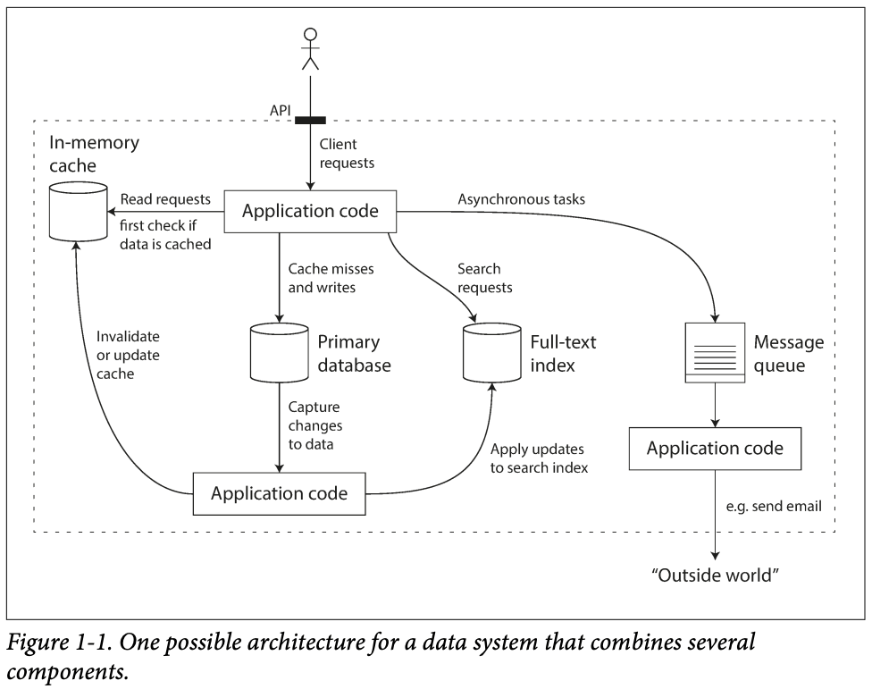

# Summary
## Data Intensive Application is typically:
- Store data to retreive it later (Database)
- Remember result of expensive operation to speed up reads (Cache)
- Allow user to search data by keyword or filter it in various ways (Search indexes)
- Preiodically crunch a large amount of accumlated data (batch processing)
## Data Systems Example

